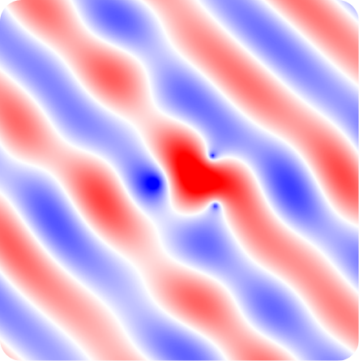

# Point scattering

Implementation of the algorithm described in [[1]](https://arxiv.org/abs/0000.00000). Under development.

<p align="center">
  
</p>

## Installation 
Run the following command :

```
pip install -e git+https://github.com/rpetit/pointscat#egg=pointscat
```

## References

[[1]](https://arxiv.org/abs/0000.00000) G. S. Alberti, R. Petit, M. Santacesaria. Localization of point scatterers via sparse optimization on measures.